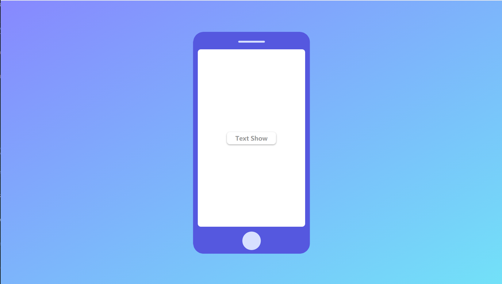

## 电脑网页转换手机查看模板




说明：这个模板可以把所有dist目录在电脑访问中转换成一个带有手机显示器的模板服务器
在手机端访问不进行处理但是会继续渲染的服务器

app.html和phone.png会自动生成

#### 使用方法：
##### 安装
```bash
npm i
```
##### 运行
```bash
npm start
```

#### 配置端口方法：

进入 config/index.js

更改port即可